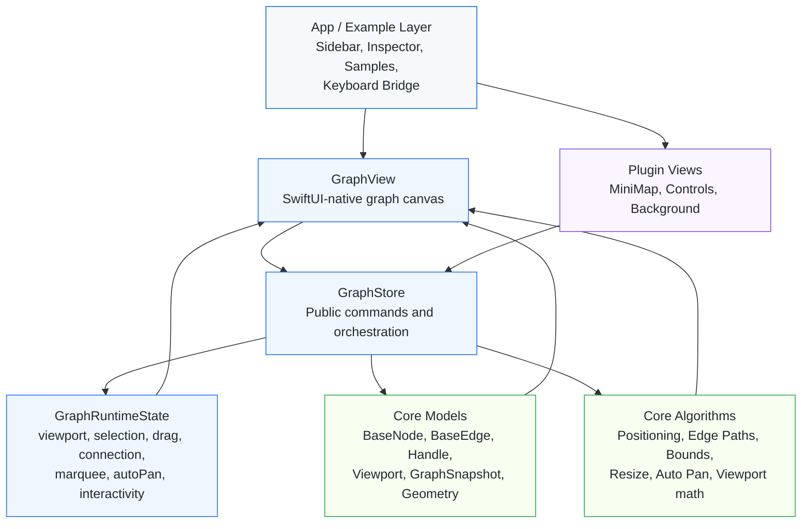

# SwGraphUI

SwGraphUI is a SwiftUI-native graph UI library for macOS and iOS.  
It uses `xyflow` as a strong behavioral and architectural reference, but it is not a direct clone. The state model, rendering pipeline, and interaction layer are adapted to SwiftUI and Apple platforms.

## Installation

### Local Development
To use `SwGraphUI` in your local project, drag the folder into your Xcode project or add it via `Package.swift`:

```swift
dependencies: [
    .package(path: "../SwGraphUI")
]
```

## Installation

Add `SwGraphUI` to your project using Swift Package Manager.

### Remote (Stable Release)
Add the package via URL:

```swift
dependencies: [
    .package(url: "https://github.com/yng13/SwGraphUI.git", from: "1.0.0")
]
```

### Local Development
For local experimentation or contribution:

```swift
dependencies: [
    .package(path: "../SwGraphUI")
]
```

Then add the product to your target:

```swift
dependencies: [
    .product(name: "SwGraphUI", package: "SwGraphUI")
]
```

## Core Concepts

- `GraphStore`: the single source of truth for nodes, edges, viewport, selection, drag, connection, and interaction state.
- `GraphView`: the main canvas view that renders nodes and edges and bridges gestures into `GraphStore`.
- `GraphNode` / `GraphEdge`: public typealiases for the generic core models.
- `PathSegment`: an intermediate geometry model used to keep edge rendering, markers, labels, and custom edge bodies consistent.
- `Viewport`: pan/zoom state represented as plain data and updated through store APIs.

## Architecture

SwGraphUI is organized into four main layers:

- `Sources/SwGraphUI/Core`
  Pure models and algorithms such as geometry, bounds, edge paths, node positioning, resize calculation, and snapshots.
- `Sources/SwGraphUI/Runtime`
  Observable store and runtime state for selection, drag, connection, viewport, marquee, and interactivity flags.
- `Sources/SwGraphUI/Public`
  Public SwiftUI-facing API such as `GraphView`, default node and edge rendering, handles, and public typealiases.
- `Sources/SwGraphUI/View`
  Internal rendering and plugin-style views such as edge labels, minimap, controls, and node resizer.



The design goal is:

- keep the core logic data-first and testable
- keep SwiftUI rendering composable
- keep interaction entry points centralized in `GraphStore`

## Features

Current capabilities include:

- node and edge rendering
- pan, wheel zoom, and pinch zoom
- node drag
- handle-based connection with screen-space snapping
- edge reconnection
- single selection, multi-selection, and marquee selection
- edge labels with styled backgrounds
- custom node views and custom edge bodies
- node toolbar style composition in examples
- minimap and controls
- configurable backgrounds (dots / lines / grid-like variants)
- node resizer
- auto pan during drag / connect
- tree-style layout application
- save / restore snapshots for nodes, edges, and viewport
- PNG / PDF export backends
- undo / redo refinement with symmetry and no-op guard tests
- accessibility baseline for nodes, edges, controls, and minimap

Platform support:

- macOS 14+
- iOS 17+

Platform notes:

- The core library is intended to work on both macOS and iOS.
- The Example app is currently developed and verified primarily on macOS.
- Some interactions are platform-specific:
  - wheel zoom, hover-driven behavior, and keyboard shortcuts are macOS-centric
  - pinch zoom and core canvas interactions are available on iOS, but the full Example workflow is not as thoroughly validated there yet

## Examples

The package includes an `Example` app with focused samples such as:

- `Basic`
- `Feature Overview`
- `Interaction Playground`
- `Custom Showcase`
- `MiniMap & Controls`
- `Edge Label`
- `Node Resizer`
- `Save & Restore`
- `Dagre Tree`
- `Subflow`

A minimal graph setup looks like this:

```swift
import SwiftUI
import SwGraphUI

@MainActor
let store = GraphStore<String>(
    nodes: [
        BaseNode(id: "A", position: XYPosition(x: 100, y: 100), data: "Node A", width: 150, height: 50),
        BaseNode(id: "B", position: XYPosition(x: 400, y: 200), data: "Node B", width: 150, height: 50),
    ],
    edges: [
        BaseEdge(id: "eA-B", source: "A", target: "B", markerEnd: EdgeMarker(type: .arrowClosed)),
    ]
)

struct GraphScreen: View {
    var body: some View {
        GraphView(store: store) { node in
            DefaultNodeView(node: node, store: store)
        }
    }
}
```

For a customized node:

```swift
GraphView(store: store) { node in
    VStack {
        Text(node.data)
            .padding(12)
            .background(.thinMaterial)
            .clipShape(RoundedRectangle(cornerRadius: 12))
    }
}
```

For a customized edge body:

```swift
GraphView(
    store: store,
    edgeBuilder: { edge, segments, color, width, viewport, containerSize, animated, reconnecting in
        AnyView(
            EdgeRenderer(
                segments: segments,
                strokeColor: edge.kind == "custom" ? .orange : color,
                strokeWidth: width,
                viewport: viewport,
                containerSize: containerSize,
                animated: animated,
                isReconnecting: reconnecting
            )
        )
    }
) { node in
    DefaultNodeView(node: node, store: store)
}
```

For save / restore snapshots:

```swift
let snapshot = store.snapshot()

let data = try JSONEncoder().encode(snapshot)
let restored = try JSONDecoder().decode(GraphSnapshot<String>.self, from: data)

store.apply(snapshot: restored)
```

For optional UI helpers such as a minimap and controls:

```swift
ZStack(alignment: .bottomTrailing) {
    GraphView(store: store) { node in
        DefaultNodeView(node: node, store: store)
    }

    MiniMapView(
        store: store,
        containerSize: Dimensions(width: 1200, height: 800)
    )
    .frame(width: 200, height: 150)
    .padding()

    ControlsView(store: store)
        .padding()
        .frame(maxWidth: .infinity, maxHeight: .infinity, alignment: .bottomLeading)
}
```

## Running the Example in Xcode

To run the included Example app from Xcode:

1. Open the package folder in Xcode:

2. In Xcode, choose the `Example` scheme.
3. Select a destination:
   - for macOS, choose `My Mac`
   - for iOS, choose an iOS Simulator or connected device
4. Run with `Cmd+R`.

If Xcode does not pick the scheme automatically, use:

- `Product > Scheme > Example`

Current recommendation:

- use the Example app on macOS for the most complete validation flow
- use iOS mainly to validate the core canvas, drag, connect, zoom, and rendering behavior

## Status

SwGraphUI already covers most core flow-editor interactions.  
It still intentionally differs from `xyflow` in several areas, especially around internal caching strategy, Apple-platform input behavior, and the remaining whiteboard / advanced UI example scope.

Note:

- Internal planning, audit, and migration documents are maintained outside the public repository surface.
- Public usage guidance is kept in this README and in the source-level API documentation.
