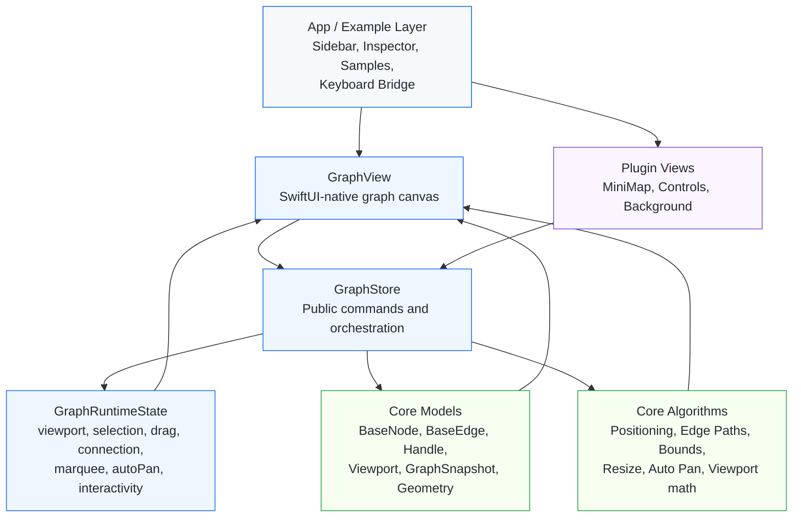

# SwGraphUI

SwGraphUI is a SwiftUI-native graph UI library for macOS and iOS.  
It uses `xyflow` as a strong behavioral and architectural reference, but it is not a direct clone. The state model, rendering pipeline, and interaction layer are adapted to SwiftUI and Apple platforms.

SwGraphUI は、macOS および iOS 向けの SwiftUI ネイティブなグラフ UI ライブラリです。  
`xyflow` を強力な振る舞いおよびアーキテクチャの参照先としていますが、直接のクローンではありません。状態モデル、レンダリングパイプライン、およびインタラクション層は、SwiftUI および Apple プラットフォームに最適化されています。

## Installation | インストール

Add `SwGraphUI` to your project using Swift Package Manager.  
Swift Package Manager を使用して、プロジェクトに `SwGraphUI` を追加します。

### Remote (Stable Release) | リモート（安定版）
Add the package via URL:  
URL を介してパッケージを追加します：

```swift
dependencies: [
    .package(url: "https://github.com/yng13/SwGraphUI.git", from: "1.0.0")
]
```

### Local Development | ローカル開発
For local experimentation or contribution:  
ローカルでの実験や貢献のために：

```swift
dependencies: [
    .package(path: "../SwGraphUI")
]
```

Then add the product to your target:  
その後、ターゲットに製品を追加します：

```swift
dependencies: [
    .product(name: "SwGraphUI", package: "SwGraphUI")
]
```

## Core Concepts | コアコンセプト

- `GraphStore`: the single source of truth for nodes, edges, viewport, selection, drag, connection, and interaction state.
- `GraphView`: the main canvas view that renders nodes and edges and bridges gestures into `GraphStore`.
- `GraphNode` / `GraphEdge`: public typealiases for the generic core models.
- `PathSegment`: an intermediate geometry model used to keep edge rendering, markers, labels, and custom edge bodies consistent.
- `Viewport`: pan/zoom state represented as plain data and updated through store APIs.

- `GraphStore`: ノード、エッジ、ビューポート、選択、ドラッグ、接続、およびインタラクション状態の唯一の信頼光源 (Single Source of Truth) です。
- `GraphView`: ノードとエッジをレンダリングし、ジェスチャを `GraphStore` にブリッジするメインキャンバスビューです。
- `GraphNode` / `GraphEdge`: 汎用コアモデルのパブリック型エイリアスです。
- `PathSegment`: エッジのレンダリング、マーカー、ラベル、およびカスタムエッジ本体の一貫性を保つために使用される中間幾何モデルです。
- `Viewport`: プレーンなデータとして表現され、ストア API を通じて更新されるパン/ズーム状態です。

## Architecture | アーキテクチャ

SwGraphUI is organized into four main layers:  
SwGraphUI は主に4つのレイヤーで構成されています：

- `Sources/SwGraphUI/Core`
  Pure models and algorithms such as geometry, bounds, edge paths, node positioning, resize calculation, and snapshots.  
  幾何学、境界計算、エッジパス、ノード測位、リサイズ計算、スナップショットなどの純粋なモデルとアルゴリズム。
- `Sources/SwGraphUI/Runtime`
  Observable store and runtime state for selection, drag, connection, viewport, marquee, and interactivity flags.  
  選択、ドラッグ、接続、ビューポート、矩形選択、およびインタラクションフラグのための Observable ストアとランタイム状態。
- `Sources/SwGraphUI/Public`
  Public SwiftUI-facing API such as `GraphView`, default node and edge rendering, handles, and public typealiases.  
  `GraphView`、デフォルトのノード/エッジレンダリング、ハンドル、パブリック型エイリアスなどの SwiftUI 向けパブリック API。
- `Sources/SwGraphUI/View`
  Internal rendering and plugin-style views such as edge labels, minimap, controls, and node resizer.  
  エッジラベル、ミニマップ、コントロール、ノードリサイザーなどの内部レンダリングおよびブラグイン形式のビュー。



The design goal is:

- keep the core logic data-first and testable
- keep SwiftUI rendering composable
- keep interaction entry points centralized in `GraphStore`

## Features | 機能一覧

Current capabilities include:  
現在の機能には以下が含まれます：

- node and edge rendering
  ノードとエッジのレンダリング
- pan, wheel zoom, and pinch zoom
  パン、ホイールズーム、およびピンチズーム
- node drag
  ノードのドラッグ
- handle-based connection with screen-space snapping
  スクリーン空間スナップによるハンドルベースの接続
- edge reconnection
  エッジの再接続
- single selection, multi-selection, and marquee selection
  単一選択、複数選択、および矩形選択
- edge labels with styled backgrounds
  規定の背景スタイルを持つエッジラベル
- custom node views and custom edge bodies
  カスタムノードビューおよびカスタムエッジ本体
- node toolbar style composition in examples
  サンプルコードにおけるノードツールバー形式の合成
- minimap and controls
  ミニマップとコントロール
- configurable backgrounds (dots / lines / grid-like variants)
  設定可能な背景（ドット / ライン / グリッドなどのバリエーション）
- node resizer
  ノードリサイザー
- auto pan during drag / connect
  ドラッグ / 接続中のオートパン
- tree-style layout application
  ツリー形式のレイアウト適用
- save / restore snapshots for nodes, edges, and viewport
  ノード、エッジ、およびビューポートのスナップショット保存 / 復元
- PNG / PDF export backends
  PNG / PDF エクスポートバックエンド
- undo / redo refinement with symmetry and no-op guard tests
  対称性および no-op ガードテストを伴う Undo / Redo の洗練
- accessibility baseline for nodes, edges, controls, and minimap
  ノード、エッジ、コントロール、およびミニマップのアクセシビリティ基盤

Platform support:  
プラットフォームサポート：

- macOS 14+
- iOS 17+

Platform notes:  
プラットフォームに関する注記：

- The core library is intended to work on both macOS and iOS.  
  コアライブラリは、macOS と iOS の両方での動作を意図しています。
- The Example app is currently developed and verified primarily on macOS.  
  Example アプリは、現在主に macOS で開発および検証されています。
- Some interactions are platform-specific:  
  一部のインタラクションはプラットフォーム固有です：
  - wheel zoom, hover-driven behavior, and keyboard shortcuts are macOS-centric  
    ホイールズーム、ホバー駆動の挙動、およびキーボードショートカットは macOS 中心です。
  - pinch zoom and core canvas interactions are available on iOS, but the full Example workflow is not as thoroughly validated there yet  
    ピンチズームやコアキャンバスのインタラクションは iOS でも利用可能ですが、フル機能の Example ワークフローはまだ iOS では十分に検証されていません。

## Examples | サンプル

The package includes an `Example` app with focused samples such as:  
パッケージには、以下のような重点的なサンプルを含む `Example` アプリが含まれています：

- `Basic`
- `Feature Overview`
- `Interaction Playground`
- `Custom Showcase`
- `MiniMap & Controls`
- `Edge Label`
- `Node Resizer`
- `Save & Restore`
- `Dagre Tree`
- `Subflow`

Note: the Example app is a verification harness, not a complete surface map of every public API.  
注記: `Example` アプリは検証用ハーネスであり、すべての公開 API や機能が個別サンプルとして反映されているわけではありません。

- some newer APIs may be documented in `README.md` before they receive a dedicated Example screen  
  一部の新しい API は、専用の Example 画面が追加される前に `README.md` 側で先に公開される場合があります
- the library surface should be treated as the source of truth over the sample inventory  
  サンプル一覧よりも、ライブラリ本体の公開 API をソース・オブ・トゥルースとして扱ってください

A minimal graph setup looks like this:  
最小限のグラフ設定は以下のようになります：

```swift
import SwiftUI
import SwGraphUI

@MainActor
let store = GraphStore<String>(
    nodes: [
        BaseNode(id: "A", position: XYPosition(x: 100, y: 100), data: "Node A", width: 150, height: 50),
        BaseNode(id: "B", position: XYPosition(x: 400, y: 200), data: "Node B", width: 150, height: 50),
    ],
    edges: [
        BaseEdge(id: "eA-B", source: "A", target: "B", markerEnd: EdgeMarker(type: .arrowClosed)),
    ]
)

struct GraphScreen: View {
    var body: some View {
        GraphView(store: store) { node in
            DefaultNodeView(node: node, store: store)
        }
    }
}
```

For a customized node:  
カスタムノードの場合：

```swift
GraphView(store: store) { node in
    VStack {
        Text(node.data)
            .padding(12)
            .background(.thinMaterial)
            .clipShape(RoundedRectangle(cornerRadius: 12))
    }
}
```

For a customized edge body:  
カスタムエッジ本体の場合：

```swift
GraphView(
    store: store,
    edgeContextBuilder: { context in
        AnyView(
            EdgeRenderer(
                segments: context.graphSegments,
                strokeColor: context.edge.kind == "custom" ? .orange : context.strokeColor,
                strokeWidth: context.strokeWidth,
                viewport: context.viewport,
                containerSize: context.containerSize,
                animated: context.animated,
                isReconnecting: context.isReconnecting
            )
        )
    }
) { node in
    DefaultNodeView(node: node, store: store)
}
```

`edgeContextBuilder` is the preferred API for new code. It exposes both graph-space and screen-space edge data explicitly:
新規コードでは `edgeContextBuilder` を推奨します。graph-space と screen-space の両方を明示的に扱えます。

- `graphSegments`: edge geometry in graph coordinates
- `screenSegments`: edge geometry already transformed into screen coordinates
- `screenPath`: ready-to-draw SwiftUI `Path`

For external layout engines or application-defined ranks/orders:  
外部レイアウトエンジンや、アプリ側で決めた rank/order を使う場合：

```swift
let ranked = GraphLayoutAlgorithms.layoutRanked(
    nodes: store.nodes,
    ranks: [
        "router-1": 0,
        "core-1": 1,
        "access-1": 2,
        "access-2": 2,
    ],
    order: [
        "access-1": 0,
        "access-2": 1,
    ],
    options: RankedLayoutOptions(
        direction: .leftToRight,
        spacing: 56,
        maxRankBreadth: 480,
        wrappedLaneSpacing: 72
    )
)

store.applyLayout(
    positions: ranked,
    undoTitle: "Apply Ranked Layout | ランク付きレイアウトの適用"
)
```

`layoutRanked(...)` is intended for cases where the application owns the semantic layer model.  
`layoutRanked(...)` は、意味的なレイヤー構造をアプリ側が持っているケース向けです。

- the app decides `ranks` and `order`
- SwGraphUI assigns coordinates and preserves spacing/direction rules
- optional breadth capping and deterministic lane wrapping are configured through `RankedLayoutOptions`
- `store.applyLayout(positions:)` applies the result with undo/no-op protection

If your domain also provides semantic component IDs, pack them in a separate step:
アプリ側が semantic component ID も持っている場合は、component packing を別段で適用できます。

```swift
let packed = GraphLayoutAlgorithms.packComponents(
    positions: ranked,
    nodes: store.nodes,
    component: [
        "router-1": 0,
        "core-1": 0,
        "access-1": 1,
        "access-2": 1,
    ],
    direction: .leftToRight,
    gap: 160
)

store.applyLayout(
    positions: packed,
    undoTitle: "Pack Components | コンポーネント配置"
)
```

This separation is intentional:
この分離は意図的です。

- `layoutRanked(...)` handles generic coordinate assignment from external rank/order input
- `packComponents(...)` handles semantic component spacing when the application has that knowledge
- application-specific role inference remains outside SwGraphUI

If your application stores node centers instead of top-left origins, use the built-in helpers:
アプリ側がノード位置を top-left ではなく center 基準で持っている場合は、組み込み helper を使えます。

```swift
let size = Dimensions(width: 160, height: 72)
let center = XYPosition(x: 400, y: 200)

let origin = GraphLayoutAlgorithms.centerToTopLeft(center, size: size)
let restoredCenter = GraphLayoutAlgorithms.topLeftToCenter(origin, size: size)
```

For save / restore snapshots:  
スナップショットの保存 / 復元：

```swift
let snapshot = store.snapshot()

let data = try JSONEncoder().encode(snapshot)
let restored = try JSONDecoder().decode(GraphSnapshot<String>.self, from: data)

store.apply(snapshot: restored)
```

For optional UI helpers such as a minimap and controls:  
ミニマップやコントロールなどのオプションの UI ヘルパーを使用する場合：

```swift
ZStack(alignment: .bottomTrailing) {
    GraphView(store: store) { node in
        DefaultNodeView(node: node, store: store)
    }

    MiniMapView(
        store: store,
        containerSize: Dimensions(width: 1200, height: 800)
    )
    .frame(width: 200, height: 150)
    .padding()

    ControlsView(store: store)
        .padding()
        .frame(maxWidth: .infinity, maxHeight: .infinity, alignment: .bottomLeading)
}
```

## Running the Example in Xcode | Xcode でのサンプルの実行

To run the included Example app from Xcode:  
付属の Example アプリを Xcode から実行するには：

1. Open the package folder in Xcode:  
   Xcode でパッケージフォルダを開きます。
2. In Xcode, choose the `Example` scheme.  
   Xcode で `Example` スキームを選択します。
3. Select a destination:  
   送信先を選択します：
   - for macOS, choose `My Mac`
   - for iOS, choose an iOS Simulator or connected device
4. Run with `Cmd+R`.  
   `Cmd+R` で実行します。

If Xcode does not pick the scheme automatically, use:  
Xcode がスキームを自動的に選択しない場合は、以下を使用してください：

- `Product > Scheme > Example`

Current recommendation:  
現在の推奨事項：

- use the Example app on macOS for the most complete validation flow  
  最も完全な検証フローのために、macOS で Example アプリを使用してください。
- use iOS mainly to validate the core canvas, drag, connect, zoom, and rendering behavior  
  iOS は主にコアキャンバス、ドラッグ、接続、ズーム、およびレンダリングの挙動を検証するために使用してください。

## Status | ステータス

SwGraphUI already covers most core flow-editor interactions.  
SwGraphUI は既に主要なフローエディタのインタラクションの大部分をカバーしています。

It still intentionally differs from `xyflow` in several areas, especially around internal caching strategy, Apple-platform input behavior, and the remaining whiteboard / advanced UI example scope.  
依然として `xyflow` とは意図的に異なる部分がいくつかあり、特に内部キャッシュ戦略、Apple プラットフォームの入力挙動、および残りのホワイトボード / 高度な UI サンプルのスコープなどが挙げられます。

Note:  
注意：

- Internal planning, audit, and migration documents are maintained outside the public repository surface.  
  内部的な計画、監査、および移行ドキュメントは、公開リポジトリの外部で維持されています。
- Public usage guidance is kept in this README and in the source-level API documentation.  
  公開されている使用ガイダンスは、この README およびソースレベルの API ドキュメントに保持されています。
